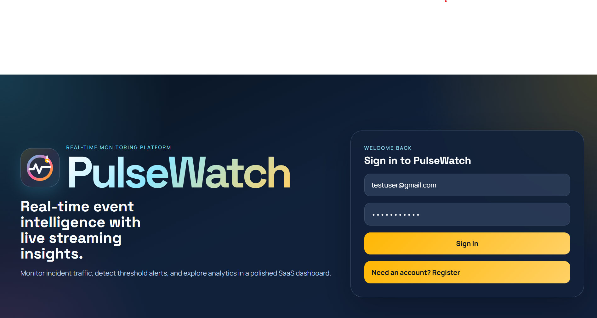
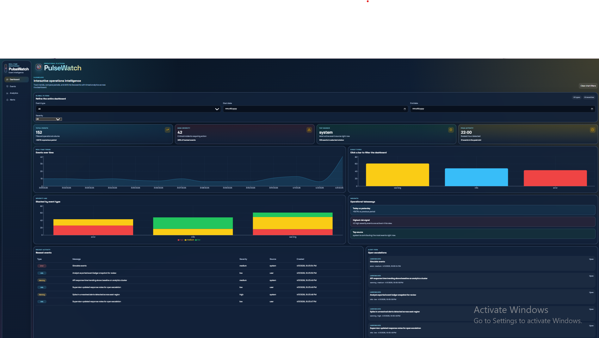
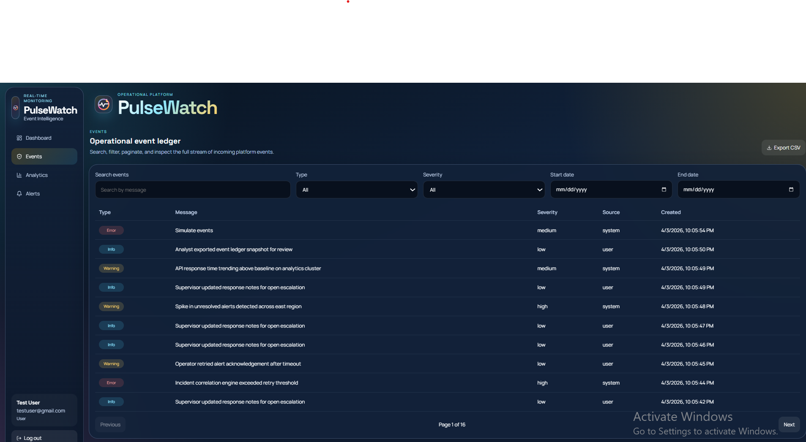
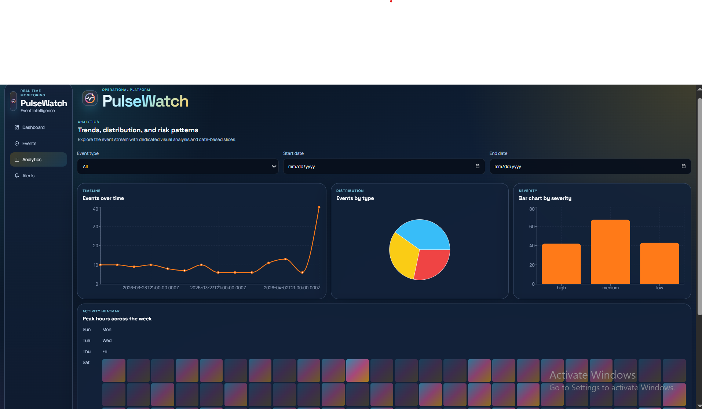

# PulseWatch

[](https://react.dev/)
[](https://nodejs.org/)
[](https://www.typescriptlang.org/)
[](https://www.mysql.com/)
[](https://socket.io/)
[](#)

PulseWatch is a full-stack real-time event intelligence platform for monitoring operational activity, detecting alert conditions, and exploring live analytics through an interactive dashboard.

It is built as a portfolio-ready SaaS-style system with authentication, role-aware access control, event ingestion APIs, live Socket.io updates, alert workflows, analytics pages, and demo-data tooling for realistic product walkthroughs.

**Author:** Mwihaki Muigai

## Table of Contents

- [Overview](#overview)
- [Highlights](#highlights)
- [Tech Stack](#tech-stack)
- [Features](#features)
- [Screenshots](#screenshots)
- [Architecture](#architecture)
- [Pages](#pages)
- [Database Schema](#database-schema)
- [API Overview](#api-overview)
- [Real-Time Flow](#real-time-flow)
- [Setup](#setup)
- [Demo Data](#demo-data)
- [Admin Access](#admin-access)
- [Build Commands](#build-commands)
- [Why This Project Matters](#why-this-project-matters)
- [Future Improvements](#future-improvements)
- [License](#license)

## Overview

PulseWatch simulates a production-style event monitoring system where events are continuously ingested, persisted, analyzed, and surfaced through a polished operational UI.

The platform supports:

- monitoring recent events in real time
- exploring analytics trends and severity patterns
- tracking and resolving alert escalations
- managing users and roles
- simulating realistic event traffic for demos and screenshots

## Highlights

- Real-time event monitoring with live dashboard updates
- JWT authentication with protected routes
- Role-based access control for `admin` and `user`
- Event ingestion, filtering, pagination, and CSV export
- Interactive analytics with linked filtering and comparison insights
- Alert generation, alert history, and alert resolution workflow
- Admin user management and role assignment
- Demo event simulator and seed tooling for product demos
- Clean modular backend architecture using TypeScript and MySQL

## Tech Stack

### Backend

- Node.js
- Express
- TypeScript
- MySQL
- Socket.io
- JWT
- Zod

### Frontend

- React
- TypeScript
- Vite
- Recharts
- Socket.io Client
- Axios

## Features

### Authentication and Access Control

- User registration and login
- JWT-based authentication
- Protected API routes
- Role-aware access with `admin` and `user`
- Admin-only user management page

### Event Management

- Create events through the API
- View recent events on the dashboard
- Browse all events on a dedicated events page
- Filter by type, severity, search term, and date range
- Paginate large event sets
- Export events as CSV
- Open event details in a modal

### Real-Time Updates

- Socket.io integration between backend and frontend
- New events broadcast to connected clients
- Alert creation broadcast live
- Dashboard and analytics refresh in real time

### Alerts

- Alert records stored in MySQL
- Triggered when high-severity activity exceeds threshold logic
- Alert history page with status filtering
- Resolve alerts from the UI

### Analytics

- Events over time
- Event type distribution
- Severity distribution
- Stacked severity breakdown by event type
- Source breakdown
- Peak activity insights
- Today vs yesterday comparison metrics
- Activity heatmap
- Clickable visualizations that drive dashboard filtering

### Demo and Portfolio Support

- Seed realistic demo events into the database
- Simulate live event streams from the dashboard
- Populate charts, feeds, alerts, and tables without an external upstream system

## Screenshots

Add your screenshots to a `screenshots/` folder in the root of the repository and update the image files if needed.

### Login



### Dashboard



### Events



### Analytics



## Architecture

```text
PULSEWATCH/
  backend/
    sql/
      schema.sql
    src/
      app.ts
      server.ts
      config/
      controllers/
      db/
      middlewares/
      models/
      routes/
      scripts/
      services/
      types/
      utils/
      validators/
  frontend/
    src/
      components/
      lib/
      pages/
      state/
```

## Backend Structure

- `controllers`: request/response handling
- `services`: business logic and orchestration
- `models`: database access and query logic
- `routes`: API route definitions
- `middlewares`: auth, validation, and error handling
- `validators`: Zod schemas
- `utils`: shared helpers, JWT helpers, event generation
- `scripts`: seed tooling

## Frontend Structure

- `pages`: routed app screens
- `components`: reusable UI blocks
- `state`: auth context and shared session state
- `lib`: API and Socket.io clients

## Pages

- `Dashboard`: high-level overview, insights, linked charts, recent activity, alert feed
- `Events`: searchable and paginated event ledger with detail modal
- `Analytics`: deep visual analysis with filters and heatmap
- `Alerts`: alert history with status filtering and resolution flow
- `Users`: admin-only user management page

## Database Schema

PulseWatch uses three main tables:

### `users`

- `id`
- `name`
- `email`
- `password`
- `role`
- `created_at`

### `events`

- `id`
- `type`
- `message`
- `severity`
- `source`
- `created_at`

### `alerts`

- `id`
- `event_id`
- `trigger_type`
- `status`
- `resolved_at`
- `created_at`

The SQL schema is available at [`backend/sql/schema.sql`](./backend/sql/schema.sql).

## API Overview

### Auth

- `POST /api/auth/register`
- `POST /api/auth/login`
- `GET /api/auth/me`

### Events

- `POST /api/events`
- `POST /api/events/simulate`
- `GET /api/events`
- `GET /api/events/:id`
- `GET /api/events/export/csv`

### Alerts

- `GET /api/alerts`
- `PATCH /api/alerts/:id/resolve`

### Analytics

- `GET /api/analytics/dashboard`

### Users

- `GET /api/users`
- `PATCH /api/users/:id/role`

## Example Event Payload

```json
{
  "type": "error",
  "message": "Route calculation failed for district dispatch corridor",
  "severity": "high",
  "source": "system"
}
```

## Real-Time Flow

1. A signed-in user or simulator posts a new event.
2. The backend stores the event in MySQL.
3. The alert service evaluates threshold conditions.
4. Socket.io emits `event:created` and, when triggered, `alert:created`.
5. Connected frontend clients update charts, tables, and alert feeds live.

## Setup

### 1. Clone the repository

```bash
git clone <your-repository-url>
cd PULSEWATCH
```

### 2. Create the MySQL database

Run the SQL schema from [`backend/sql/schema.sql`](./backend/sql/schema.sql) in MySQL Workbench or through the MySQL CLI.

### 3. Configure backend environment variables

Copy [`backend/.env.example`](./backend/.env.example) to `backend/.env`.

Example:

```env
PORT=4000
CLIENT_URL=http://localhost:5173
DB_HOST=localhost
DB_PORT=3306
DB_USER=root
DB_PASSWORD=your_mysql_password
DB_NAME=pulsewatch
JWT_SECRET=your_secret_key
JWT_EXPIRES_IN=1d
HIGH_SEVERITY_THRESHOLD=5
```

### 4. Configure frontend environment variables

Copy [`frontend/.env.example`](./frontend/.env.example) to `frontend/.env`.

Example:

```env
VITE_API_URL=http://localhost:4000/api
VITE_SOCKET_URL=http://localhost:4000
```

### 5. Install dependencies

```bash
cd backend
npm install

cd ../frontend
npm install
```

### 6. Start the backend

```bash
cd backend
npm run dev
```

Backend runs on:

- `http://localhost:4000`

### 7. Start the frontend

```bash
cd frontend
npm run dev
```

Frontend runs on:

- `http://localhost:5173`

## Demo Data

PulseWatch is built to be demo-friendly even without a live upstream production system.

### Seed historical demo data

```bash
cd backend
npm run seed:demo
```

This populates the database with realistic events and alert history for screenshots and analytics demos.

### Simulate live events

Use the `Simulate Events` control in the dashboard ingestion panel to generate real-time traffic and watch the system update live.

## Admin Access

Public registration creates standard `user` accounts by default.

To promote an account to admin, run:

```sql
UPDATE users SET role = 'admin' WHERE email = 'your-admin@email.com';
```

## Build Commands

### Backend

```bash
cd backend
npm run build
npm run start
```

### Frontend

```bash
cd frontend
npm run build
npm run preview
```

## Why This Project Matters

PulseWatch demonstrates practical understanding of:

- event-driven architecture
- real-time communication
- dashboard design
- REST API design
- role-based access control
- data visualization
- SQL-backed analytics workflows
- full-stack TypeScript development

## Future Improvements

- refresh tokens and password reset flows
- test coverage for services and controllers
- configurable alert thresholds from the UI
- stronger alert deduplication logic
- background jobs and rate limiting
- deployment configuration for cloud hosting

## License

Use the license of your choice for the repository, for example MIT.
